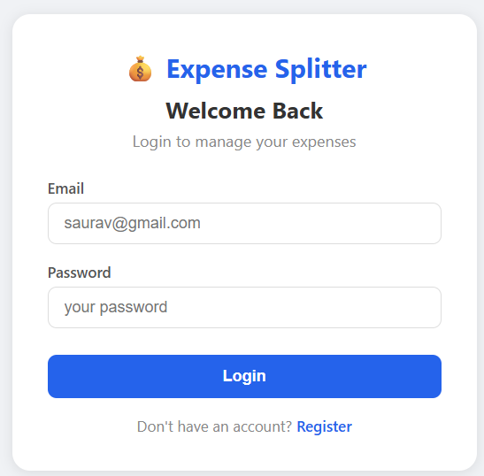
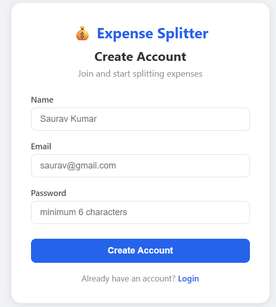
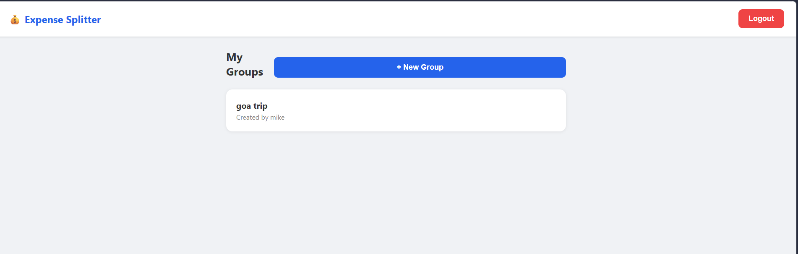
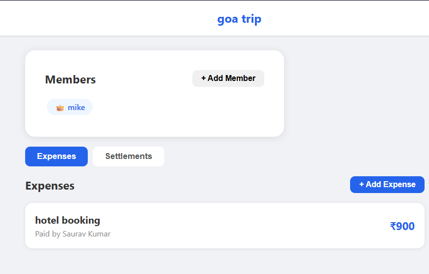

# 💰 Expense Splitter & Settlement App

A full stack expense splitting application similar to Splitwise — built with Java Spring Boot and HTML/CSS/JS.

Users can create groups, add expenses, and the system automatically calculates who owes whom and minimizes settlement transactions.

---

## 🚀 Features

- Users register and log in with **JWT authentication**
- Create groups like **"Goa Trip"** or **"Flat Expenses"**
- Add members to groups by their email
- Add expenses — system **automatically splits equally** among selected members
- Payer's share is **auto-marked as settled**
- View who owes whom and how much in the **Settlements tab**
- Settle up with **one click**
- Every endpoint **secured with Spring Security** — no unauthorized access

---

## 📄 File Overview

### 🔧 Backend

| File | Description |
|------|-------------|
| `src/main/java/.../controller/AuthController.java` | REST endpoints for register and login |
| `src/main/java/.../controller/GroupController.java` | REST endpoints for group management |
| `src/main/java/.../controller/ExpenseController.java` | REST endpoints for expense management |
| `src/main/java/.../controller/SettlementController.java` | REST endpoints for settlements |
| `src/main/java/.../service/UserService.java` | Business logic for auth — register, login |
| `src/main/java/.../service/GroupService.java` | Business logic for groups and members |
| `src/main/java/.../service/ExpenseService.java` | Business logic for expenses and splits |
| `src/main/java/.../service/SettlementService.java` | Business logic for settlement calculation |
| `src/main/java/.../repository/UserRepository.java` | Database queries for users |
| `src/main/java/.../repository/GroupRepository.java` | Database queries for groups |
| `src/main/java/.../repository/GroupMemberRepository.java` | Database queries for group members |
| `src/main/java/.../repository/ExpenseRepository.java` | Database queries for expenses |
| `src/main/java/.../repository/ExpenseSplitRepository.java` | Database queries for expense splits |
| `src/main/java/.../model/User.java` | User entity — maps to users table |
| `src/main/java/.../model/Group.java` | Group entity — maps to expense_groups table |
| `src/main/java/.../model/GroupMember.java` | GroupMember entity — maps to group_members table |
| `src/main/java/.../model/Expense.java` | Expense entity — maps to expenses table |
| `src/main/java/.../model/ExpenseSplit.java` | ExpenseSplit entity — maps to expense_splits table |
| `src/main/java/.../security/JwtUtil.java` | Generates and validates JWT tokens |
| `src/main/java/.../security/JwtAuthenticationFilter.java` | Intercepts every request and verifies token |
| `src/main/java/.../security/SecurityConfig.java` | Spring Security rules and configuration |
| `src/main/java/.../security/PasswordConfig.java` | BCrypt password encoder configuration |
| `src/main/java/.../exception/GlobalExceptionHandler.java` | Catches all exceptions and returns clean errors |
| `src/main/java/.../exception/ResourceNotFoundException.java` | Thrown when a resource is not found — 404 |
| `src/main/java/.../exception/EmailAlreadyExistsException.java` | Thrown when email is already registered — 409 |
| `src/main/java/.../exception/UnauthorizedException.java` | Thrown when action is not permitted — 403 |
| `src/main/java/.../dto/request/RegisterRequest.java` | DTO for incoming register data |
| `src/main/java/.../dto/request/LoginRequest.java` | DTO for incoming login data |
| `src/main/java/.../dto/request/CreateGroupRequest.java` | DTO for incoming create group data |
| `src/main/java/.../dto/request/AddMemberRequest.java` | DTO for incoming add member data |
| `src/main/java/.../dto/request/AddExpenseRequest.java` | DTO for incoming add expense data |
| `src/main/java/.../dto/response/AuthResponse.java` | DTO for returning JWT token |
| `src/main/java/.../dto/response/UserResponse.java` | DTO for returning user data — no password |
| `src/main/java/.../dto/response/GroupResponse.java` | DTO for returning group data |
| `src/main/java/.../dto/response/ExpenseResponse.java` | DTO for returning expense data |
| `src/main/java/.../dto/response/SplitResponse.java` | DTO for returning split and settlement data |
| `src/main/resources/application.properties` | App configuration — database, Redis, JWT |
| `pom.xml` | Maven dependencies and project configuration |

### 🌐 Frontend

| File | Description |
|------|-------------|
| `frontend/index.html` | Login page for existing users |
| `frontend/register.html` | Registration page for new users |
| `frontend/dashboard.html` | Main dashboard showing all groups |
| `frontend/group.html` | Group details with expenses and settlements |
| `frontend/css/style.css` | All styling for the entire frontend |
| `frontend/js/api.js` | All API calls to the Spring Boot backend |
| `frontend/js/auth.js` | Login and register page logic |
| `frontend/js/dashboard.js` | Dashboard page logic |
| `frontend/js/group.js` | Group details page logic |

---

## 🧑‍💻 How to Run

### ⚙️ Backend

1. Make sure you have **Java 17**, **MySQL 8.0**, **Docker** and **Maven** installed.

2. Start Redis using Docker:
```bash
docker run -d -p 6379:6379 redis
```

3. Create the MySQL database:
```sql
CREATE DATABASE expense_splitter;
```

4. Open `src/main/resources/application.properties` and update:
```properties
spring.datasource.url=jdbc:mysql://localhost:3306/expense_splitter
spring.datasource.username=root
spring.datasource.password=YOUR_MYSQL_PASSWORD
```

5. Run the backend:
```bash
mvn spring-boot:run
```

Backend starts on `http://localhost:8080`

### 🌐 Frontend

1. Open `frontend/index.html` in any modern web browser.
2. Register a new account or login with existing credentials.
3. Create a group, add members, add expenses and track settlements.

---

## 📬 API Endpoints

| Method | Endpoint | Description |
|--------|----------|-------------|
| POST | /api/auth/register | Register a new user |
| POST | /api/auth/login | Login and receive JWT token |
| POST | /api/groups | Create a new group |
| GET | /api/groups/my | Get all groups for logged in user |
| GET | /api/groups/{id} | Get group details by id |
| POST | /api/groups/{id}/members | Add a member to a group |
| POST | /api/groups/{id}/expenses | Add an expense to a group |
| GET | /api/groups/{id}/expenses | Get all expenses in a group |
| GET | /api/settlements/group/{id} | Get all unsettled debts in a group |
| PUT | /api/settlements/settle/{id} | Mark a debt as settled |

---

## 🛠️ Tech Stack

| Layer | Technology |
|-------|------------|
| Language | Java 17 |
| Backend Framework | Spring Boot 3 |
| Security | Spring Security 7, JWT |
| ORM | Hibernate 7, JPA |
| Database | MySQL 8.0 |
| Cache | Redis 7 |
| Build Tool | Maven |
| Frontend | HTML5, CSS3, JavaScript |

---

## 📸 Screenshots

### 🔐 Login Page



### 📝 Register Page



### 🏠 Dashboard



### 👥 Group Details



---

## 👨‍💻 Author

**Saurav Kumar**
- GitHub: [@vsaur](https://github.com/vsaur)
- LinkedIn: [linkedin.com/in/saurav-kumar-05bb65248](https://linkedin.com/in/saurav-kumar-05bb65248)
- Email: isaurav2001@gmail.com
